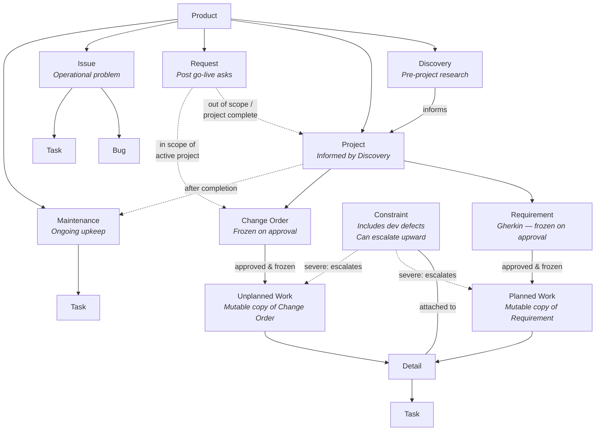

# ADO Work Item Hierarchy — Digital Product Portfolio

**Date**: 2026-03-20
**Process Template**: Digital Product Portfolio - Electric Boogaloo
**Status**: Approved

## Hierarchy Diagram



## Work Item Types — Summary

### Portfolio & Planning

| Type | Purpose | Parent | Frozen? |
|------|---------|--------|---------|
| **Product** | Highest bucket. Holds Projects, Requests, Issues, Maintenance | — | No |
| **Discovery** | Pre-project research & intake. Informs Project creation | Product | No |
| **Project** (*Epic) | Spans days/weeks. Summary informed by Discovery | Product | No |
| **Requirement** | Gherkin scenarios. Derived from Discovery + Project context. Scoped before work starts | Project | Yes — frozen on approval |
| **Change Order** | Scope changes mid-project | Project | Yes — frozen on approval |

### Execution

| Type | Purpose | ADO Parent | Linked To | Notes |
|------|---------|------------|-----------|-------|
| **Planned Work** | Mutable execution copy of a frozen Requirement | **Project** (sibling of Requirement) | Requirement via "Duplicate Of" | Created after scope approval. Same parent as its Requirement — NOT a child of the Requirement |
| **Unplanned Work** | Mutable execution copy of a frozen Change Order | **Project** (sibling of Change Order) | Change Order via "Duplicate Of" | Same pattern as Planned Work |
| **Detail** (*Feature) | High-level breakdown of work (one per Gherkin scenario) | Planned/Unplanned Work | | |
| **Task** | Lowest level. Measurable implementation bites (hours) | Detail | | |
| **Constraint** | Inevitable issues during development, including defects found during dev. Can impact multiple items. Escalates upward if severe | Detail (attached) | | Can escalate to Planned/Unplanned Work |

### Requirement → Planned Work Relationship (Important)

The frozen Requirement and its mutable Planned Work are **siblings under the Project**, not parent-child. This is by design:

- The Requirement is the **immutable spec** — it stays frozen as the audit-trail record of what was scoped
- The Planned Work is the **mutable execution copy** — it gets Details, Tasks, and Constraints attached during development
- They are linked via ADO's **"Duplicate / Duplicate Of"** relation type, which serves as the traceability link between spec and execution
- Both sit at the same hierarchy level under the Project, so the Project view shows specs and their execution copies side by side

```
Project #11956: Rocktober
├── Requirement #11957 (frozen spec)     ──"Duplicate"──→  PW #11967 (execution copy)
│                                                          ├── Detail (Scenario 1)
│                                                          │   ├── Task
│                                                          │   └── Task
│                                                          └── Detail (Scenario 2)
│                                                              └── Task
├── Requirement #11958 (frozen spec)     ──"Duplicate"──→  PW #11968 (execution copy)
│                                                          └── ...
```

The Mermaid diagram's `→` arrow ("approved & frozen") represents the spawn/copy action, not a parent-child link. The "Duplicate Of" ADO link provides traceability back to the original spec.

### Post-Development / Operational

| Type | Purpose | Parent | Notes |
|------|---------|--------|-------|
| **Request** | Feature/report requests from users after go-live | Product | Can become a new Project (out of scope) or Change Order (in scope of active project) |
| **Issue** | Unplanned operational problems. Should have an end date | Product | |
| **Bug** | Unforeseen defects in production | Issue | Post-development only |
| **Task** | Operational implementation work | Issue or Maintenance | |
| **Maintenance** | Ongoing upkeep from completed Projects | Product | If a bug surfaces, it becomes an Issue |

## Key Rules

1. **Gherkin acceptance criteria** on Requirements and Change Orders
2. **Freeze on approval** — Requirements and Change Orders are immutable once approved, preserving original scope record
3. **Planned/Unplanned Work are the mutable copies** — Constraints affect these, never the frozen originals
4. **Constraints escalate** — a severe Constraint can change the status of its parent Planned/Unplanned Work
5. **Bugs only exist in operational contexts** — during development, defects are Constraints
6. **Maintenance surfaces bugs as Issues** — clean separation between proactive upkeep and reactive problems
7. **Requests route to Projects or Change Orders** — depending on whether the originating project is complete or active

## Framework Changes Required

### CONTEXT.md
- [ ] Fix wiki name typo: `Digital---Product-Portfolio.wiki` → `Digital---Project-Portfolio.wiki`
- [ ] Expand Type → State Mappings to cover all work item types (currently only Task and Requirement are mapped)
- [ ] Add Work Item Hierarchy section documenting the full type tree and parent-child relationships

### ado.md Provider
- [ ] Update keyword detection to map to correct hierarchy levels (not just flat type detection)
- [ ] Add parent-child linking on creation (e.g., Detail under Planned Work, Task under Detail)
- [ ] Add Gherkin format enforcement for Requirements and Change Orders
- [ ] Add freeze/approval semantics — prevent edits to approved Requirements and Change Orders
- [ ] Add Planned Work creation workflow (copy of approved Requirement into Org Unit bucket)
- [ ] Add Constraint escalation logic (severe Constraints change parent Planned/Unplanned Work status)

### work.md Command
- [ ] `/work add` needs hierarchy awareness — what type are we creating and where does it attach?
- [ ] `/work refine` should produce Gherkin scenarios (Given/When/Then) for Requirements and Change Orders
- [ ] `/work ready` (or new `/work approve`) should trigger freeze + Planned Work copy creation
- [ ] Constraint handling — `/work block` or new subcommand for attaching Constraints to Details

### Local Work Item Files
- [ ] Acceptance criteria format: Gherkin for Requirements/Change Orders, checklists for Details/Tasks
- [ ] Add `Frozen` field for Requirements/Change Orders (set on approval)
- [ ] Track parent-child relationships in item metadata (ADO parent ID + local parent W-NNN)

### Wiki Documentation
- [ ] Update `How-We-Use-DevOps.md` with new diagram (replaces outdated PDF)
- [ ] Add type-level documentation for Change Orders, Constraints, Discovery (not currently in wiki)
