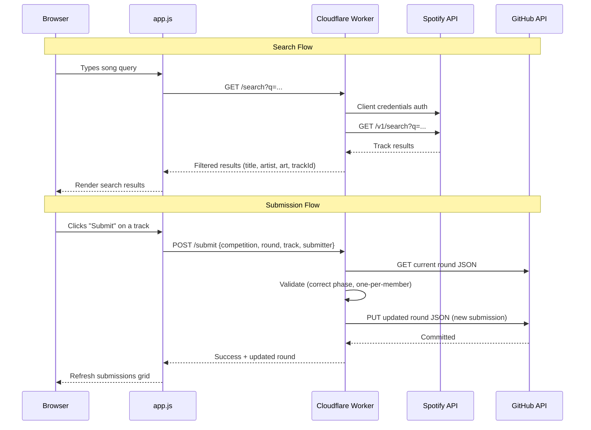

# Song Search & Submission — Architecture

**Work Item**: W-11970 (ADO #11970)
**Branch**: `feat/W-11970-song-search`
**Date**: 2026-03-24

## Sequence Diagram

## Design Decisions

### Worker Endpoints
| Method | Path | Purpose |
|--------|------|---------|
| `GET` | `/search?q=<query>` | Search Spotify, return filtered results |
| `POST` | `/submit` | Submit a song to the current round |
| `GET` | `/health` | Health check |

### Worker → GitHub API (not git)
The Cloudflare Worker cannot run git commands. It uses the GitHub Contents API to:
1. **Read** the current round JSON (`GET /repos/{owner}/{repo}/contents/competitions/{slug}/rounds/day-{NN}.json`)
2. **Update** the round JSON with new submission (`PUT` same path with updated content + SHA)

This means submissions are committed directly to the repo via API, maintaining the git-as-database pattern.

### Search Behavior
- **Debounce**: 300ms after last keystroke before hitting Worker
- **Results**: Max 10 tracks returned, each with title, artist, album name, album art URL, Spotify track ID
- **No Spotify account needed**: Client credentials flow is server-side only

### Submission Validation (Worker-side)
1. Round must be in `submission` phase
2. One submission per member per round — if submitter already exists, replace (with client-side confirmation)
3. Submitter must be a valid member in config.json

### UI Integration
- Search bar appears during `submission` phase only
- Search results render below the search input
- Click a result → confirmation → POST to Worker
- On success, submissions grid refreshes with new data
- Existing phase/voting/results rendering unchanged

## File Inventory

| File | Action | Purpose |
|------|--------|---------|
| `worker/index.js` | **Create** | Cloudflare Worker — search + submit endpoints |
| `worker/wrangler.toml` | **Create** | Worker configuration |
| `js/app.js` | **Modify** | Add search UI, submission flow, Worker integration |
| `index.html` | **Modify** | Add search bar + results container to submission phase area |
| `css/styles.css` | **Modify** | Style search bar, results cards, submit button |
