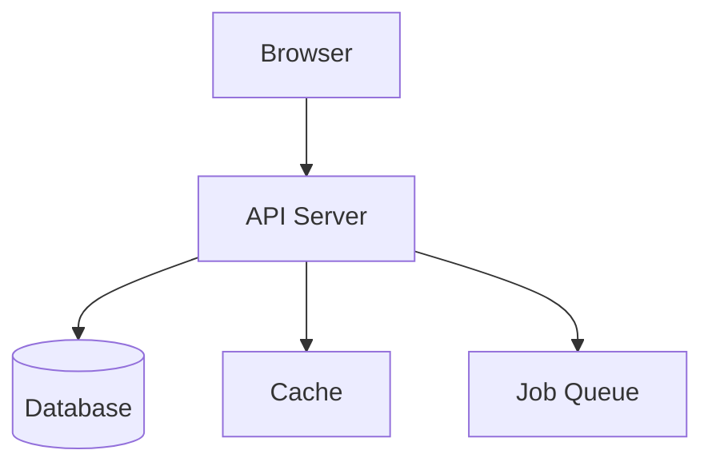
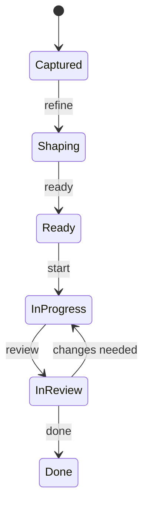

# Visual Workflow Rule

## Core Principle

**For a visual learner, always provide visual representations.**

When working on anything that has a visual or structural component, default to showing rather than telling. This applies to architecture, UI, data flow, state management, and decision-making.

## Decision Matrix: Which Tool for Which Concept

| Concept Type | Tool | Format |
|-------------|------|--------|
| Architecture overview | Mermaid | `graph TD` or `C4Context` diagram |
| Data flow | Mermaid | `sequenceDiagram` or `flowchart` |
| State machines | Mermaid | `stateDiagram-v2` |
| Entity relationships | Mermaid | `erDiagram` |
| UI layout / page design | pencil.dev or `/prototype --static` | Visual mockup |
| Component interaction | `/prototype` (Level 2) | Running interactive demo |
| Complex feature flow | `/prototype --app` (Level 3) | Multi-page prototype |
| Decision comparison | Markdown table | Side-by-side trade-offs |
| Timeline / roadmap | Mermaid | `gantt` chart |

## When to Use Visual Representations

### Always Visual

These should ALWAYS include a diagram or mockup:
- Architecture decisions (show the components and their relationships)
- UI changes (show before/after or proposed layout)
- Data model changes (show ER diagram)
- Workflow changes (show sequence or flow diagram)
- State management (show state diagram)

### Visual When Helpful

These benefit from visuals but don't always require them:
- API endpoint design (request/response examples may suffice)
- Bug fix explanations (code diff usually sufficient)
- Configuration changes (table comparison)

### Skip Visuals

These don't need diagrams:
- Typo fixes
- Dependency updates
- Documentation corrections
- One-line code changes

## Screenshot Verification (Mandatory for UI Work)

**Every UI change must be verified with screenshots.**

### Workflow

1. **Before**: Capture the current state (if modifying existing UI)
2. **Implement**: Make the change
3. **After**: Capture the new state
4. **Zoom**: Use preview zoom on specific areas — buttons, text, spacing, alignment. Don't assume code = correct.
5. **Analyze**: Compare before/after AND against `.pen` design with this checklist:
   - Positioning and alignment correct?
   - Dimensions match expectations?
   - Visual appearance matches design source of truth (`.pen` file)?
   - Spacing consistent with design system tokens?
   - Interactive elements functional?
   - Text readable at intended size?
6. **Report**: Show findings to user

### Expert Assignment for UI Work

| UI Task | Primary Expert | Supporting Expert |
|---------|---------------|-------------------|
| New page/layout | expert-frontend | expert-ux |
| Component design | expert-frontend | expert-ux |
| Accessibility fix | expert-ux | expert-frontend |
| Design system update | expert-ux | expert-frontend |
| Animation/interaction | expert-frontend | expert-ux |

## Mermaid Diagram Guidelines

### Keep Diagrams Readable
- Max 10-15 nodes for architecture diagrams
- Use subgraphs to group related components
- Label edges with actions, not just relationships
- Use consistent colors/styles within a diagram

### Examples

**Architecture:**


**State Machine:**


## pencil.dev as Living Design Reference

**For UI projects, the `.pen` file is the source of truth.**

### Autonomous pencil.dev Workflow

Claude can operate pencil.dev without human intervention:

1. **Launch** (if not running):
   ```powershell
   powershell.exe -NoProfile -Command "Start-Process '<pencil-install-path>\Pencil.exe'"
   ```
   MCP tools connect automatically after ~3 seconds.

2. **Open/create** `.pen` file via `open_document` MCP tool

3. **Save empty file immediately** (MCP has no save command — use PowerShell SendKeys):
   ```powershell
   powershell.exe -NoProfile -Command "Add-Type -AssemblyName Microsoft.VisualBasic; Add-Type -AssemblyName System.Windows.Forms; [Microsoft.VisualBasic.Interaction]::AppActivate('Pencil'); Start-Sleep -Milliseconds 500; [System.Windows.Forms.SendKeys]::SendWait('^s')"
   ```

4. **Verify file exists on disk** before proceeding:
   ```bash
   ls -la path/to/file.pen
   ```

5. **Design** via `batch_design`, `set_variables`, `batch_get`, etc.

6. **Save periodically** using the same Ctrl+S SendKeys command after significant batches of work

7. **Final verify** — file exists on disk + `get_screenshot` for visual check

**CRITICAL — File creation order:**

Always create the file at the target path FIRST, save it empty, verify it exists on disk, THEN build content. This prevents two failure modes:

- **Never build content into a `new` (unnamed) document.** An unnamed document triggers a native Save As dialog on Ctrl+S that Claude cannot interact with. All work is lost.
- **Never assume `open_document(path)` creates the file on disk.** It creates it in memory only. You must `Ctrl+S` and verify with `ls` before building content.

The correct sequence is: `open_document(path)` → `Ctrl+S` → `ls` verify → `set_variables` → `batch_design` → `Ctrl+S` → `get_screenshot`

### Build Phase UI Verification (Mandatory)

During build phase, every UI change must follow this verification loop:

1. **Code** the change
2. **Inspect first** — Use `preview_inspect` on the CSS selectors of changed elements to verify computed values (overflow, width, padding, color, contrast). This catches layout issues (e.g., button overflow) without needing pixel-level screenshots.
3. **Screenshot** the live app at the affected screen
4. **Element-level verification** — Use `find` to locate specific elements by description, then zoom to their exact coordinates. Do NOT guess viewport coordinates after scrolling.
5. **Compare** against the `.pen` design using `get_screenshot` on the corresponding design node
6. **Fix** discrepancies before moving on

**Verification priority order:**
- `preview_inspect` for CSS property values (fastest, most reliable)
- `find` + coordinate-based zoom for layout/visual confirmation
- Full-page screenshot for overall composition
- `.pen` screenshot comparison for design fidelity

Skipping this loop is how UI drift happens. The loop takes 30 seconds and prevents change orders.

### Design System Versioning

Pencil.dev has no built-in version control. **Create a new `.pen` file per design iteration** rather than overwriting:

```
design-system.pen      — v1: initial discovery mockups
design-system-v2.pen   — v2: change order revisions (usability pass, new screens)
design-system-v3.pen   — v3: next change order
```

**Why new files, not overwrites:**
- Git history shows the diff, but `.pen` files are binary — diffs aren't human-readable
- Distinct files allow side-by-side comparison in pencil.dev (open both)
- The user can review v(N) against v(N-1) visually before approving
- Approved version becomes the implementation reference; prior versions are the audit trail

**Naming convention:** `design-system-v{N}.pen` where N increments with each change order or design iteration. The version without a suffix is the original.

**Approval gate:** Every new design system version requires user approval before implementation begins. The `.pen` file is the source of truth — implementation follows it, not the other way around.

### Design Token Flow

```
.pen file (design tokens) → /sketch tokens → CSS custom properties → Implementation
```

When design tokens change in the `.pen` file, `/sketch sync` detects the diff and reports affected areas.

## Design System Completeness Standards

A design system `.pen` file is not complete until it covers all of the following. These standards apply to any project using pencil.dev as the design source of truth.

### Canvas Organization

- **Do NOT add custom text labels** to the canvas. Pencil's built-in node name badges serve this purpose and custom labels collide with them.
- **Name every frame descriptively** — "Screen — Settings Page", "Song Card", "Error State" — so the canvas is self-documenting via Pencil's node badges.
- **Minimum spacing**: 50px gap between all top-level nodes on the canvas. This accounts for Pencil's ~25px node name badge above each frame. Verify with `snapshot_layout(maxDepth: 0)` and check that no two nodes overlap or butt against each other.
- **Group by type**: Components in the top area, screens below. Within each group, related items in columns.

### Component Completeness Checklist

Every interactive element in the design must have visuals for its outcomes. If a button exists, the result of clicking it must be designed. Missing interaction visuals lead to guessing or skipping during implementation.

| Element Type | Required States |
|-------------|----------------|
| **Buttons** | Default, hover (optional), disabled, loading |
| **Destructive actions** (delete, reset) | Confirmation dialog with cancel/confirm |
| **Auth flows** (login, OAuth) | Loading, success, error states |
| **Form submissions** | Validation error, success toast/redirect |
| **Toggle switches** | On state, off state |
| **Vote/selection** | Default, selected, disabled (own item), already-voted |
| **Async operations** (API calls) | Loading, success, error |

### Screen Completeness Checklist

Every feature flow must include these screens at minimum:

| Screen Type | Purpose |
|-------------|---------|
| **Happy path** | The main screen in its working state |
| **Empty state** | What the user sees before any data exists |
| **Loading state** | What the user sees while data loads |
| **Error state** | What the user sees when something fails |
| **Mobile viewport** (375px) | How the screen adapts to mobile width |

### CRUD Coverage

If the app manages entities (competitions, members, playlists), the design system must include screens for:
- **Create** — How does a new entity get created?
- **Read** — How is it displayed? (usually the main screens)
- **Update** — How is it edited? (usually Settings/Admin)
- **Delete/Reset** — How is it removed? (confirmation dialog required)

Missing CRUD flows = missing Worker endpoints = features that can't be tested end-to-end.

### Overflow Prevention

Run `snapshot_layout(problemsOnly: true, maxDepth: 5)` before presenting the design system for review. Zero problems must be the baseline. Common overflow sources:
- Text content longer than its container (use `textGrowth: "fixed-width"` with `width: "fill_container"`)
- Fixed-height containers with variable content (use `height: "fit_content"`)
- Horizontal button rows at narrow widths (use `flex-wrap` in CSS, or stack vertically on mobile)

## Integration with Other Rules

- **artifact-first.md** — Visual artifacts ARE the "show me before you build" mechanism
- **work-system.md** — Items in Shaping stage should include relevant diagrams
- **roles-and-governance.md** — Visual artifacts enable the architect to make informed decisions
- **testing-standards.md** — Visual regression tests catch drift that screenshot verification misses between sessions

## Anti-Patterns

**Wall of text instead of diagram**: Describing architecture in prose when a diagram would be clearer

**Diagram without explanation**: Showing a complex diagram with no context or legend

**Over-diagramming**: Creating a Mermaid chart for "rename variable X to Y"

**Stale diagrams**: Implementing something different from what the diagram shows

**Deleting the wrong duplicate set**: When duplicate content exists on a canvas (e.g., from a failed save + rebuild), screenshot both sets and verify which has complete content before deleting either. The "more complete" set is always the one to keep.

**Skipping visual inspection**: Checking coordinate numbers is not the same as looking at the output. Always take a screenshot after layout changes — coordinates can be correct while the visual result is wrong (label collisions, badge overlaps, spacing issues).

**Missing interaction outcomes**: Designing a button without designing what happens when it's clicked. Every interactive element needs its result state in the design system.

**Designing for desktop only**: Mobile viewport (375px) screens are required, not optional. Overflow issues are worst at narrow widths and must be caught in the design system, not discovered during implementation.
