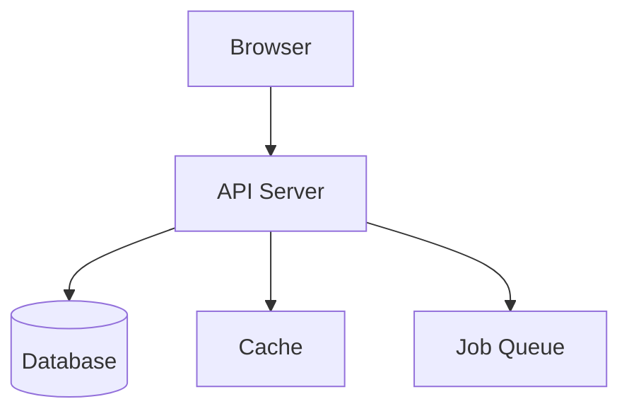
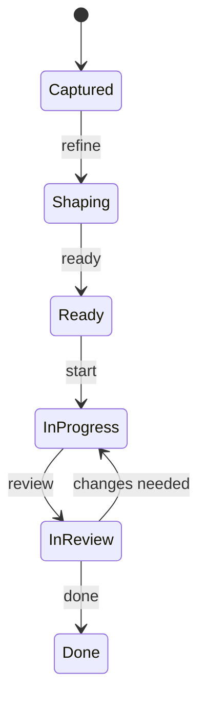

# Visual Workflow Rule

## Core Principle

**For a visual learner, always provide visual representations.**

When working on anything that has a visual or structural component, default to showing rather than telling. This applies to architecture, UI, data flow, state management, and decision-making.

## Decision Matrix: Which Tool for Which Concept

| Concept Type | Tool | Format |
|-------------|------|--------|
| Architecture overview | Mermaid | `graph TD` or `C4Context` diagram |
| Data flow | Mermaid | `sequenceDiagram` or `flowchart` |
| State machines | Mermaid | `stateDiagram-v2` |
| Entity relationships | Mermaid | `erDiagram` |
| UI layout / page design | pencil.dev or `/prototype --static` | Visual mockup |
| Component interaction | `/prototype` (Level 2) | Running interactive demo |
| Complex feature flow | `/prototype --app` (Level 3) | Multi-page prototype |
| Decision comparison | Markdown table | Side-by-side trade-offs |
| Timeline / roadmap | Mermaid | `gantt` chart |

## When to Use Visual Representations

### Always Visual

These should ALWAYS include a diagram or mockup:
- Architecture decisions (show the components and their relationships)
- UI changes (show before/after or proposed layout)
- Data model changes (show ER diagram)
- Workflow changes (show sequence or flow diagram)
- State management (show state diagram)

### Visual When Helpful

These benefit from visuals but don't always require them:
- API endpoint design (request/response examples may suffice)
- Bug fix explanations (code diff usually sufficient)
- Configuration changes (table comparison)

### Skip Visuals

These don't need diagrams:
- Typo fixes
- Dependency updates
- Documentation corrections
- One-line code changes

## Screenshot Verification (Mandatory for UI Work)

**Every UI change must be verified with screenshots.**

### Workflow

1. **Before**: Capture the current state (if modifying existing UI)
2. **Implement**: Make the change
3. **After**: Capture the new state
4. **Zoom**: Use preview zoom on specific areas — buttons, text, spacing, alignment. Don't assume code = correct.
5. **Analyze**: Compare before/after AND against `.pen` design with this checklist:
   - Positioning and alignment correct?
   - Dimensions match expectations?
   - Visual appearance matches design source of truth (`.pen` file)?
   - Spacing consistent with design system tokens?
   - Interactive elements functional?
   - Text readable at intended size?
6. **Report**: Show findings to user

### Expert Assignment for UI Work

| UI Task | Primary Expert | Supporting Expert |
|---------|---------------|-------------------|
| New page/layout | expert-frontend | expert-ux |
| Component design | expert-frontend | expert-ux |
| Accessibility fix | expert-ux | expert-frontend |
| Design system update | expert-ux | expert-frontend |
| Animation/interaction | expert-frontend | expert-ux |

## Mermaid Diagram Guidelines

### Keep Diagrams Readable
- Max 10-15 nodes for architecture diagrams
- Use subgraphs to group related components
- Label edges with actions, not just relationships
- Use consistent colors/styles within a diagram

### Examples

**Architecture:**


**State Machine:**


## pencil.dev as Living Design Reference

**For UI projects, the `.pen` file is the source of truth.**

### Autonomous pencil.dev Workflow

Claude can operate pencil.dev without human intervention:

1. **Launch** (if not running):
   ```powershell
   powershell.exe -NoProfile -Command "Start-Process '<pencil-install-path>\Pencil.exe'"
   ```
   MCP tools connect automatically after ~3 seconds.

2. **Open/create** `.pen` file via `open_document` MCP tool

3. **Design** via `batch_design`, `set_variables`, `batch_get`, etc.

4. **Save** (MCP has no save command — use PowerShell SendKeys):
   ```powershell
   powershell.exe -NoProfile -Command "Add-Type -AssemblyName Microsoft.VisualBasic; Add-Type -AssemblyName System.Windows.Forms; [Microsoft.VisualBasic.Interaction]::AppActivate('Pencil'); Start-Sleep -Milliseconds 500; [System.Windows.Forms.SendKeys]::SendWait('^s')"
   ```

5. **Verify** file exists on disk + `get_screenshot` for visual check

### Build Phase UI Verification (Mandatory)

During build phase, every UI change must follow this loop:

1. **Code** the change
2. **preview_screenshot** the live app at the affected screen
3. **Zoom** into specific areas to verify details (don't assume code = correct)
4. **Compare** against the `.pen` design using `get_screenshot` on the corresponding design node
5. **Fix** discrepancies before moving on

Skipping this loop is how UI drift happens. The loop takes 30 seconds and prevents change orders.

### Design Token Flow

```
.pen file (design tokens) → /sketch tokens → CSS custom properties → Implementation
```

When design tokens change in the `.pen` file, `/sketch sync` detects the diff and reports affected areas.

## Integration with Other Rules

- **artifact-first.md** — Visual artifacts ARE the "show me before you build" mechanism
- **work-system.md** — Items in Shaping stage should include relevant diagrams
- **roles-and-governance.md** — Visual artifacts enable the architect to make informed decisions
- **testing-standards.md** — Visual regression tests catch drift that screenshot verification misses between sessions

## Anti-Patterns

**Wall of text instead of diagram**: Describing architecture in prose when a diagram would be clearer

**Diagram without explanation**: Showing a complex diagram with no context or legend

**Over-diagramming**: Creating a Mermaid chart for "rename variable X to Y"

**Stale diagrams**: Implementing something different from what the diagram shows
